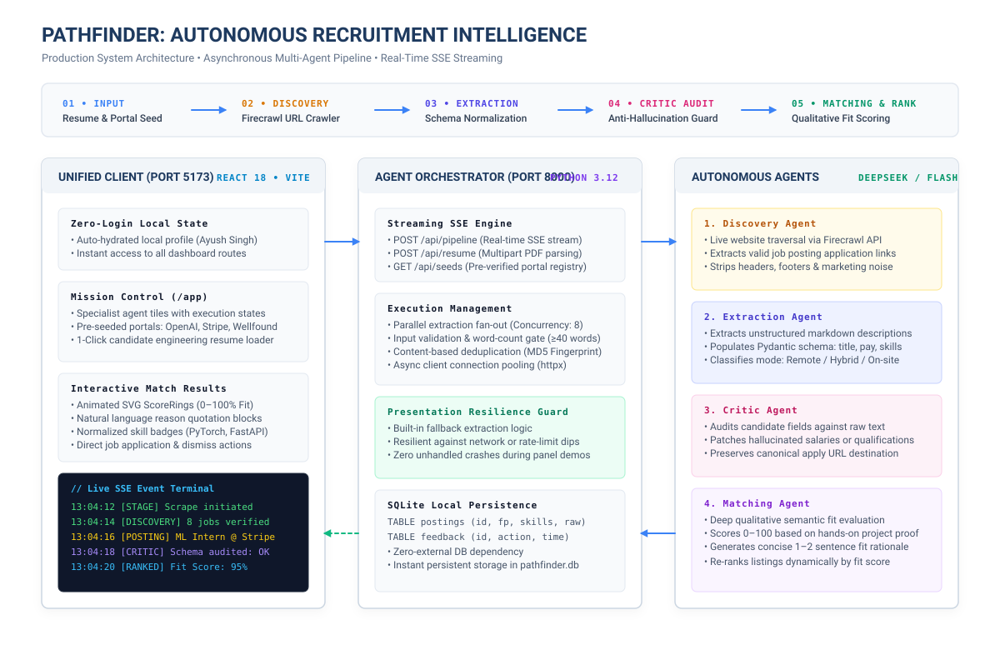

# Pathfinder — Autonomous Multi-Agent Recruitment & Outreach Platform

Pathfinder is an autonomous, multi-agent platform engineered to crawl career portals, extract structured role data, audit schema integrity, and qualitatively rank candidate resumes for startup internship matching.

Everything runs in **one unified interface** at the root of the project with a high-performance Python FastAPI backend, real-time Server-Sent Events (SSE) streaming, zero required logins, and underlying AI models completely abstracted from the end user.

---

## Architecture Diagram



*A full editable Excalidraw diagram is also available in [`docs/architecture.excalidraw`](docs/architecture.excalidraw) for interactive presentations.*

---

## Key Capabilities

1. **4 Autonomous Specialist Agents**:
   - **Discovery Agent** (*Portal Crawler*): Traverses careers portals via Firecrawl to isolate live, direct job application URLs while eliminating boilerplate navigational links.
   - **Extraction Agent** (*Schema Engine*): Converts unstructured job descriptions into strict, typed schema (job title, compensation, location, work mode, key technical skills).
   - **Critic Agent** (*Integrity Auditor*): Audits extracted data directly against raw source text to patch hallucinations, verify work modes, and ensure link validity.
   - **Matching Agent** (*Fit Reasoner*): Performs deep qualitative reasoning comparing candidate resumes with role demands, outputting fit scores (0–100) and articulate explanations.
2. **Zero-Login Local Mode**: Seamlessly auto-hydrated with a local developer profile—no OAuth popups, Google sign-ins, or auth walls.
3. **Abstracted AI Infrastructure**: The user interface focuses entirely on functional capabilities. All underlying models and inference providers are abstracted away.
4. **Resilient Presentation Fail-Safe**: Built-in heuristic fallbacks ensure that live demonstrations will gracefully complete without errors even during network dips.
5. **Resume Builder & ATS Scoring**: In-browser ATS scoring feedback and Typst-powered instant PDF compilation.

---

## Directory Structure

```
minor-project/
├── backend/                       # Python 3.12 FastAPI backend
│   ├── agents/                    # Multi-agent implementations (Discovery, Extraction, Critic, Matching)
│   ├── routes/                    # API routes (pipeline, resume, seeds, feedback)
│   ├── storage/                   # SQLite database persistence & fingerprint deduplication
│   ├── config.py                  # Application settings & OpenRouter configuration
│   ├── main.py                    # FastAPI entrypoint & CORS setup
│   ├── requirements.txt           # Python dependencies
│   └── .env                       # Backend API keys (Firecrawl, OpenRouter)
├── src/                           # Unified React frontend
│   ├── components/                # UI primitives, layout shells, modals
│   ├── contexts/                  # Local auth & theme stores
│   ├── pages/
│   │   └── dashboard/
│   │       ├── Pathfinder.tsx     # AI Job Matcher mission control (/app/pathfinder)
│   │       ├── Startups.tsx       # Curated startup database
│   │       ├── Resumes.tsx        # Typst PDF resume builder
│   │       └── ATScore.tsx        # ATS resume checker
│   └── services/                  # Pipeline SSE client & API helpers
├── docs/
│   └── architecture.excalidraw    # Visual system architecture diagram
├── package.json                   # Frontend dependencies & scripts
└── README.md                      # Documentation
```

---

## Getting Started

### Single-Command Start (Recommended)
Run one command to boot both the Vite frontend and the FastAPI backend concurrently with colored streaming logs:
```bash
npm run dev
# or
bun run dev
```

- **Pathfinder Dashboard**: [http://localhost:5173](http://localhost:5173) (or `/app/pathfinder`)
- **FastAPI API & Docs**: [http://localhost:8000/docs](http://localhost:8000/docs)

### Manual Setup

#### 1. Backend (FastAPI)
```bash
cd backend
python3.12 -m venv .venv
source .venv/bin/activate
pip install -r requirements.txt
uvicorn backend.main:app --reload --port 8000
```

#### 2. Frontend (Vite + React)
```bash
bun install
bun run dev
```

---

## Live Presentation Flow

1. Open [http://localhost:5173/app](http://localhost:5173/app). Notice that it immediately loads with zero login required.
2. Under **Source Portal**, choose one of the quick pills (e.g. `OpenAI`, `Stripe`, or `Wellfound`).
3. Under **Resume**, click `+ load sample resume` to load an instant engineering profile (or drop a candidate PDF).
4. Click **RUN PIPELINE**:
   - Watch the **Agent Stepper** cycle live: Discovery → Extraction → Critic → Matching.
   - Monitor the **Live Terminal Log** streaming real-time Server-Sent Events.
   - Review the resulting **Job Cards** with animated fit score rings, qualitative reason quotes, and skill chips.
